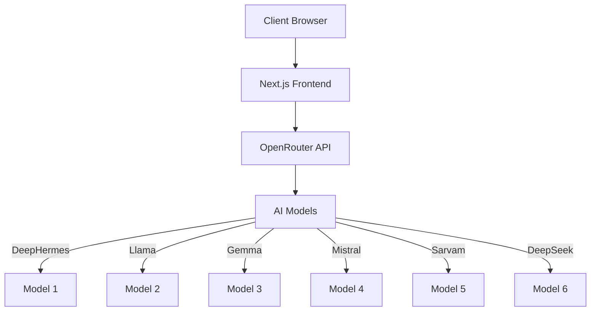
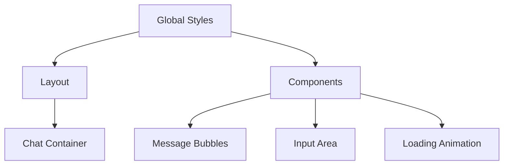

# AI Chat Assistant

A modern, responsive chat application built with Next.js that integrates with OpenRouter's AI models. The application provides a clean, user-friendly interface for interacting with various AI models.

## System Architecture



## Technical Stack

### Frontend
- **Framework**: Next.js 14 (App Router)
- **Language**: TypeScript
- **Styling**: CSS3 with modern features
- **State Management**: React Hooks
- **API Integration**: Fetch API

### Backend Integration
- **API Provider**: OpenRouter (Chat) + Hugging Face (Images)
- **Authentication**: API Key based
- **Models**: Multiple AI models with fallback mechanism
- **Image Generation**: FLUX.1-schnell via Hugging Face Inference API

## Features

- 🤖 Multiple AI Model Support
  - NousResearch DeepHermes
  - Meta Llama
  - Google Gemma
  - Mistral AI
  - Sarvam AI
  - DeepSeek

- 💬 Real-time Chat Interface
  - Clean, modern UI
  - Message history
  - Loading animations
  - Responsive design

- 🎨 AI Image Generation
  - Text-to-image using FLUX.1-schnell model
  - Smart prompt detection (e.g., "generate an image of...")
  - High-quality image output
  - One-click download functionality
  - Responsive image display

- 🎤 Voice Input Support
  - Real-time speech-to-text transcription
  - Live voice input with visual feedback
  - Support for both voice and text input
  - Browser-based speech recognition
  - Voice control for both chat and image generation

- 🎨 Modern UI/UX
  - Smooth animations
  - Responsive layout
  - Mobile-friendly design
  - Dynamic message formatting
  - Auto-expanding text input
  - Voice button with visual feedback

## Prerequisites

- Node.js 18.x or later
- npm or yarn
- OpenRouter API key
- Hugging Face API token (for image generation)
- Modern browser with Web Speech API support (for voice input)

## Getting Started

1. Clone the repository:
```bash
git clone <repository-url>
cd ai-chat-assistant
```

2. Install dependencies:
```bash
npm install
# or
yarn install
```

3. Create a `.env.local` file in the root directory with your API keys:
```env
NEXT_PUBLIC_OPENROUTER_API_KEY=your_openrouter_api_key_here
NEXT_PUBLIC_HUGGINGFACE_TOKEN=your_huggingface_token_here
NEXT_PUBLIC_SITE_URL=http://localhost:3000
NEXT_PUBLIC_SITE_NAME=AI Chat Assistant
```

4. Start the development server:
```bash
npm run dev
# or
yarn dev
```

5. Open [http://localhost:3000](http://localhost:3000) in your browser.

## How to Use

### Chat Functionality
- Type your message in the text area and press Enter or click Send
- The AI will respond using one of the available models
- Chat history is maintained during your session

### Image Generation
Simply type natural language requests like:
- "Generate an image of a cat wearing a hat"
- "Create a picture of a futuristic city at night"
- "Show me an image of a peaceful mountain lake"
- "Make an illustration of a robot playing guitar"

The system will automatically detect your image request and generate a high-quality image using the FLUX.1-schnell model. You can then download the image with a single click.

### Voice Input
1. **Click the microphone button** (🎤) in the input area
2. **Start speaking** - you'll see your words appear in real-time
3. **The button turns red** while recording with a pulsing animation
4. **Click again to stop** or wait for automatic stop
5. **Use voice for any input** - both chat messages and image generation prompts

**Voice Commands Examples:**
- 🎤 "Hello, how are you today?"
- 🎤 "Generate an image of a sunset over the ocean"
- 🎤 "Create a picture of a dragon flying through clouds"

## Project Structure

```
src/
├── app/
│   ├── globals.css    # Global styles
│   ├── layout.tsx     # Root layout
│   └── page.tsx       # Main chat interface
├── utils/
│   ├── chat.ts        # Chat utilities and API calls
│   └── constants.ts   # Configuration constants
```

## Implementation Details

### 1. Chat Interface
```typescript
// Message Interface
interface Message {
    role: 'user' | 'assistant';
    content: string;
}

// API Configuration
const API_URLS = {
    OPENROUTER_API: "https://openrouter.ai/api/v1/chat/completions",
    LOCAL_URL: "http://localhost:3000"
};
```

### 2. Model Integration
```typescript
const AI_MODELS = [
    "nousresearch/deephermes-3-mistral-24b-preview:free",
    "meta-llama/llama-3.3-8b-instruct:free",
    "google/gemma-3n-e4b-it:free",
    // ... other models
];
```

### 3. API Call Structure
```typescript
const response = await fetch(API_URLS.OPENROUTER_API, {
    method: "POST",
    headers: {
        "Authorization": `Bearer ${API_KEY}`,
        "Content-Type": "application/json"
    },
    body: JSON.stringify({
        model: currentModel,
        messages: chatHistory
    })
});
```

## CSS Architecture



### Key CSS Features
- CSS Variables for theming
- Flexbox for layout
- CSS Grid for complex layouts
- CSS Animations
- Media Queries for responsiveness

## Technologies Used

- Next.js 14
- TypeScript
- CSS3 with modern features
- OpenRouter API (Chat functionality)
- Hugging Face Inference API (Image generation)
- Web Speech API (Voice input)
- FLUX.1-schnell Model (Image generation)

## Features in Detail

### AI Model Integration
- Automatic model fallback if one fails
- Support for multiple AI models
- Real-time model switching

### UI Components
- Responsive chat container
- Message bubbles with different styles for user and bot
- Loading animations
- Auto-expanding textarea input
- Voice input button with visual feedback
- Image display with download functionality
- Formatted message display

### Message Formatting
- Support for numbered lists
- Proper spacing and alignment
- Dynamic content rendering

### Image Generation
- **Smart Detection**: Automatically detects image requests from natural language
- **Prompt Examples**:
  - "Generate an image of a sunset over mountains"
  - "Create a picture of a futuristic city"
  - "Show me an image of a peaceful forest"
  - "Make an illustration of a robot dancing"
- **High-Quality Output**: Uses FLUX.1-schnell model for professional results
- **Download Feature**: One-click download with automatic filename generation
- **Responsive Display**: Images scale properly on all devices

### Voice Input
- **Real-time Transcription**: See your words appear as you speak
- **Live Feedback**: Visual indicators show when recording is active
- **Cross-Platform**: Works in Chrome, Edge, and other Chromium browsers
- **Dual Input**: Combine voice and text input seamlessly
- **Voice Commands**: Use voice for both chat and image generation

## Performance Considerations

1. **API Optimization**
   - Model fallback mechanism
   - Error handling
   - Response caching

2. **UI Performance**
   - Lazy loading
   - Optimized animations
   - Efficient state management

3. **Responsive Design**
   - Mobile-first approach
   - Flexible layouts
   - Adaptive components

## Contributing

1. Fork the repository
2. Create your feature branch (`git checkout -b feature/AmazingFeature`)
3. Commit your changes (`git commit -m 'Add some AmazingFeature'`)
4. Push to the branch (`git push origin feature/AmazingFeature`)
5. Open a Pull Request

## License

This project is licensed under the MIT License - see the LICENSE file for details.

## Acknowledgments

- OpenRouter for providing access to multiple AI models
- Next.js team for the amazing framework
- All contributors who have helped improve this project
